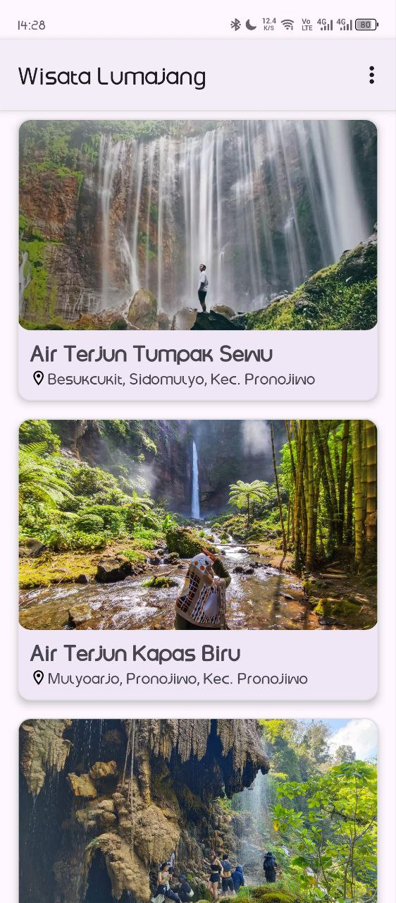
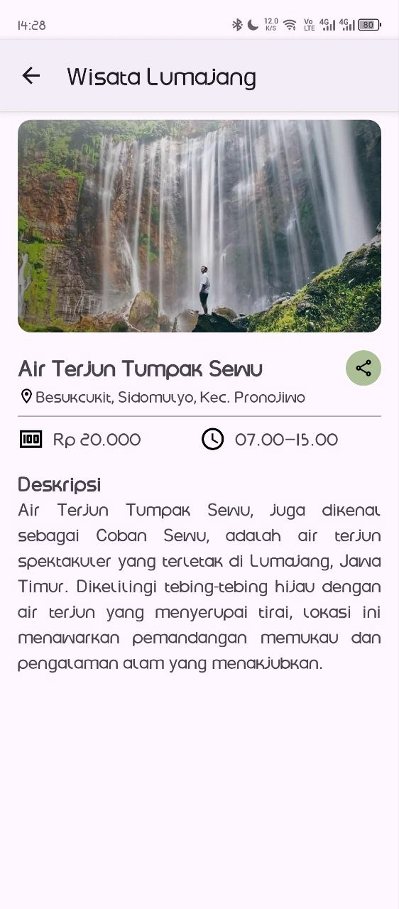

# Daftar Wisata Lumajang

## 📖 Description
A simple Android app that displays a list of tourist destinations in **Lumajang**.  
Features include:
- Main Page with a list of at least 10 places (RecyclerView).
- Detail Page showing title, image, and longer description (with ScrollView).
- About Page with photo, name, and email.

---

## 📸 Screenshot

  
  
  

---

## ✅ Closure
This project was created as part of a **Dicoding submission task**.  
Built with **Kotlin** and Android Studio.  
